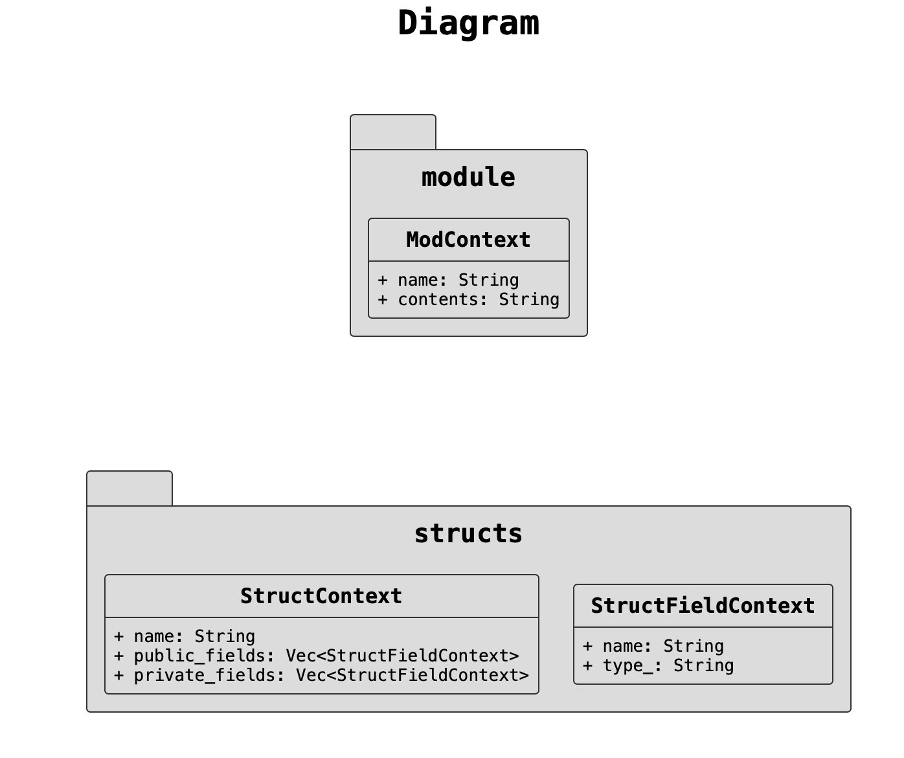

# Diagram Generator

Generate a diagram from your rust code.

## Usage

```shell
Generate a diagram from Rust source code

Usage: cargo-diagram.exe [OPTIONS]

Options:
  -p, --path <PATH>      Path to main.rs or lib.rs
  -o, --output <OUTPUT>  Path to output the diagram
  -h, --help             Print help
  -V, --version          Print version
```

The generated diagram will be saved in the same directory where you run the command.

## Example


